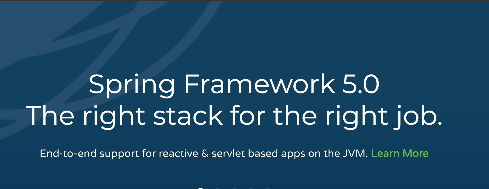
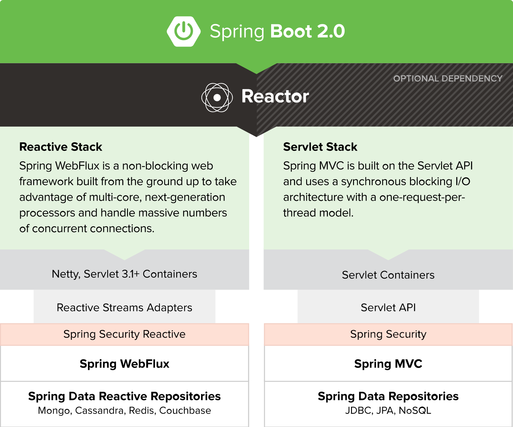
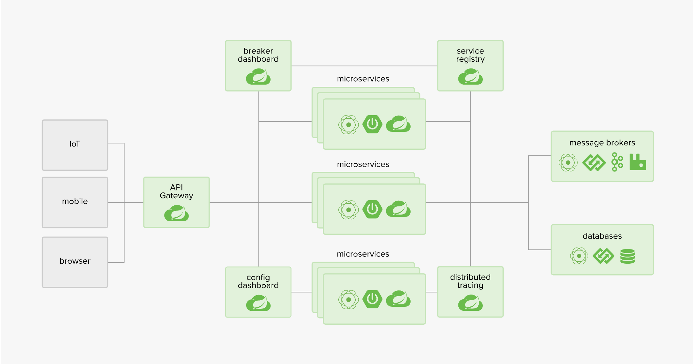

# Spring Framework 介绍

Version 5.0.1.RELEASE. [Source](https://github.com/spring-projects/spring-framework)

> 

# Spring Boot

[Source](https://github.com/spring-projects/spring-boot)

> 

# Spring Cloud

[Source](https://github.com/spring-cloud)

> 

### 参考

- [spring-framework-reference](https://docs.spring.io/spring/docs/current/spring-framework-reference/index.html)
- [Spring 框架简介 .2005](https://www.ibm.com/developerworks/cn/java/wa-spring1/)