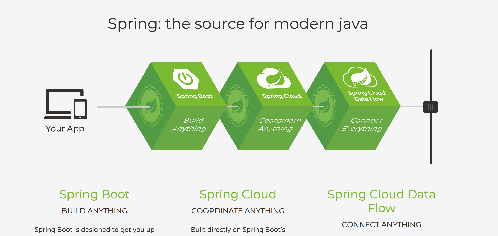

# Spring Projects 介绍

[Spring](https://spring.io/): **the source for modern java.**
> 

Spring 是一个开源的项目, 社区开发活跃度非常高. 在 Java 技术栈中地位很高, Java Web 的项目基本都以 Spring Framework 为基础框架. 

Spring 有[很多项目](https://spring.io/projects), 如 `Spring Framework`, `Spring Boot`, `Spring Cloud`, `Spring Data` 等, 每个项目一般都有多个模块.

## 设计哲学 (Spring Framework)

> 当你去学习一个框架时, 除了要知道这个框架可以做什么, 了解这个框架所遵循的原则同样很重要. 后者可能对你更有意义.

以下为开发 Spring Framework 的指导原则:

- 在各个系统层面提供选择
> 比如: Spring 允许你在编码之前不用做出最终设计决策, 你可以通过修改配置文件改变你的持久层提供者而不需要修改代码
- 支持形形色色的应用场景
> Spring 拥抱灵活并不固执于事情应该怎么做
- 向后兼容
- 注重 API 的设计
- 高标准的代码质量

# Spring Framework

## 历史

> 第一版由 Rod Johnson 开发, 并在2002年10月发布在 Expert One-on-One J2EE Design and Development 一书中. 2003年6月, Spring Framework 第一次发布在 Apache 2.0 许可证下. 2004年3月, 发布了里程碑的版本1.0, 2004年9月以及2005年3月，又发布了新的里程碑版本. 2006年, Spring Framework 获得了 Jolt 生产力奖 和 JAX 创新奖.

> 2006年10月发布Spring 2.0, 2007年11月 Spring 2.5, 2009年12月 Spring 3.0,2011年 Spring 3.1, 2013年11月 Spring 3.2.5, 2013年12月发布了4.0版本. 值得注意的是, Spring 4.0 版本中增加了对 Java SE 8, Groovy 2, Java EE7 的一些方面以及 WebSocket 的支持. 2015年7月31号发布 4.2.0. 2016年6月10日 4.3. 4.3 版本将是 Spring 4 系列的最后一个版本, 4.3.x 的支持将到 2019 年.

> 新一代 Spring, 2017年9月28号 发布 5.0.0

[Source](https://github.com/spring-projects/spring-framework)

> 

# Spring Boot

[Source](https://github.com/spring-projects/spring-boot)

> 

# Spring Cloud

[Source](https://github.com/spring-cloud)

> 

### 参考

- [spring-framework-reference](https://docs.spring.io/spring/docs/current/spring-framework-reference/index.html)
- [Wikipedia](https://en.wikipedia.org/wiki/Spring_Framework)
- [Spring 框架简介 .2005](https://www.ibm.com/developerworks/cn/java/wa-spring1/)